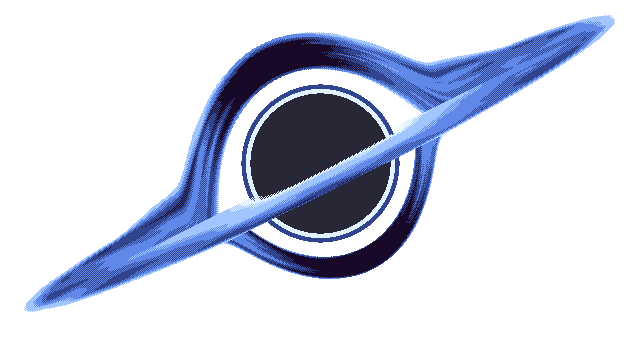

# VortexJS: Ignite Your 2D Game Development Journey 🚀

  

At this point in time, **VortexJS** is a 2D framework, not yet a full-fledged engine. Our primary focus is on providing a robust and enjoyable developer experience, ensuring that you have the tools you need to bring your 2D games to life. While 3D capabilities are not currently within the scope of this project, we are committed to continuous improvement.

## Unleash Creativity with VortexJS
VortexJS is not just a 2D framework; it's a gateway to unleashing your creative prowess. Craft captivating games with *fluid animations*, **stunning graphics**, and a developer-friendly experience that empowers your ideas to take flight.

## Powered by PixiJS: A Visual Symphony
**Powered by PixiJS:**
VortexJS harnesses the rendering power of [**PixiJS**](https://pixijs.com/), a fast 2D rendering engine that excels in creating visually stunning graphics and animations. By leveraging PixiJS, VortexJS inherits a solid foundation for rendering, allowing developers to create captivating 2D games with ease.

## What Sets VortexJS Apart?
- 🚀 **Performance**: Experience unparalleled performance with a *lightweight* and *efficient* 2D framework.
- 🤝 **Community-Driven**: Join a thriving community of passionate developers committed to pushing the boundaries of game development.
- 🌐 **Web-based Magic**: Build games that mesmerize players directly in their browsers, breaking down barriers to entry.

## Future Directions
**Future Directions:**
We have ambitious plans for VortexJS. As we continue to refine and enhance its features, our goal is to push the boundaries of what a 2D framework can offer. However, we acknowledge that the world of game development is dynamic, and our aspirations include exploring the realm of 3D game engines.

## Towards a 3D Future
**Towards a 3D Future:**
While VortexJS is currently a 2D framework, we have our sights set on a future where we can deliver a cutting-edge 3D engine. We believe in setting high standards for our projects, and when the time is right, and we are confident that we can surpass expectations, we will transition to developing a 3D engine from scratch.

## Contribute and Shape the Future
VortexJS is more than just code; it's a collaborative canvas for creators. Your ideas, feedback, and contributions will sculpt the future of VortexJS. Together, let's redefine what's possible in the world of 2D gaming.

## Ready to Dive In?
Whether you're a seasoned developer or a curious newcomer, VortexJS welcomes you. Ignite your passion for game development, explore the possibilities, and turn your visions into pixelated masterpieces.

🔗 **[Get Started](#)** | 🌟 **[Explore Demos](#)** | 🤖 **[Contribute](CONTRIBUTING.md)**

Embark on the journey with VortexJS—where coding meets creativity, and every commit propels us into a world of endless possibilities. Let the game development adventure begin! ☄️🚀

## License

This project is licensed under the [Apache License 2.0](LICENSE) - see the [LICENSE](LICENSE.txt) file for details.